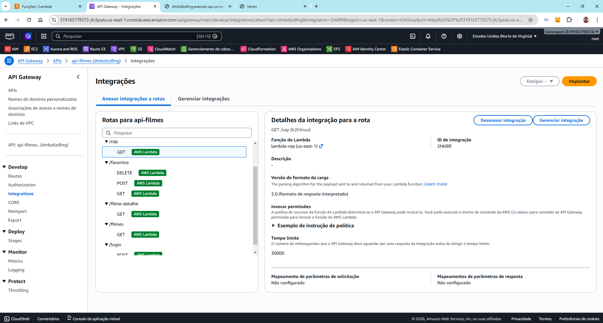
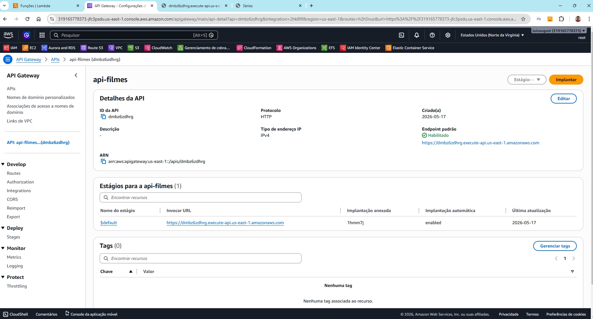
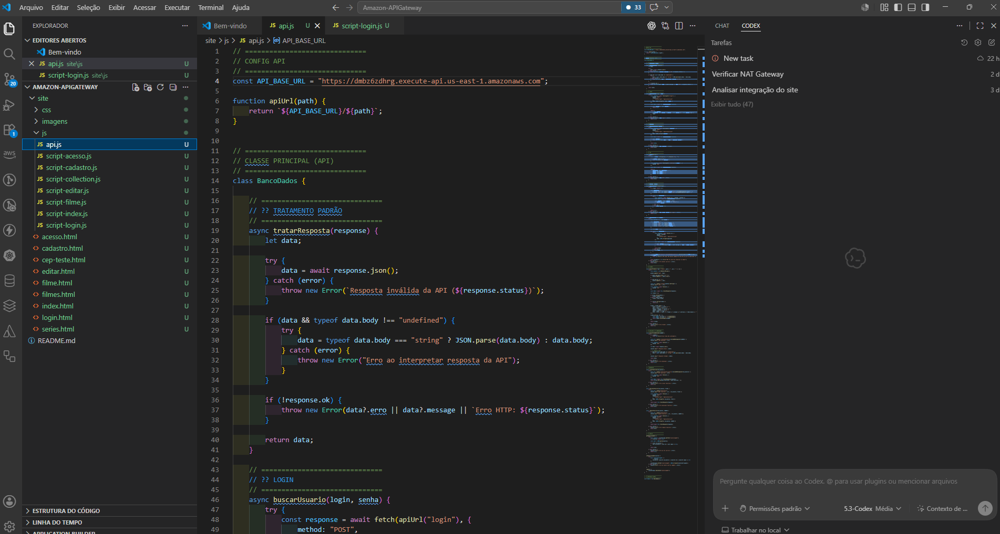
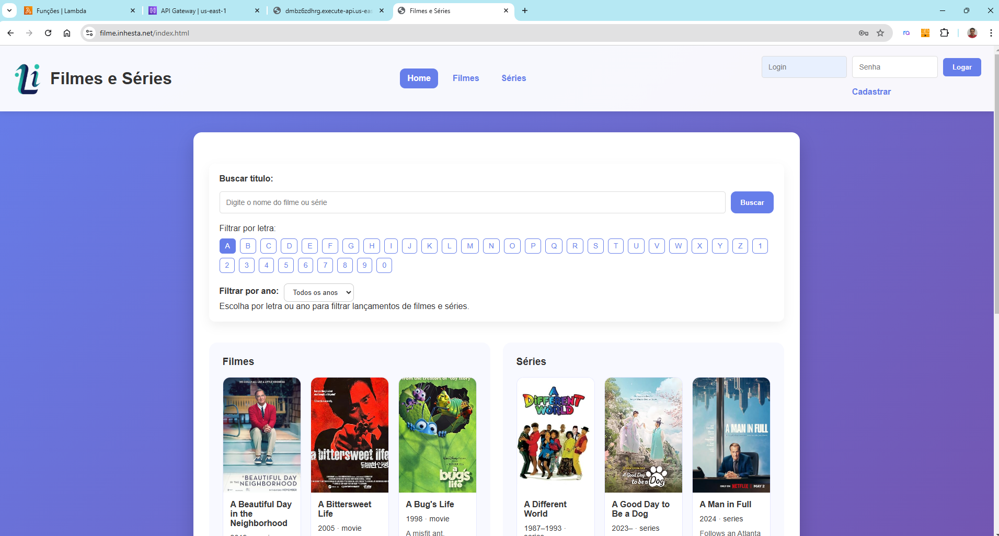
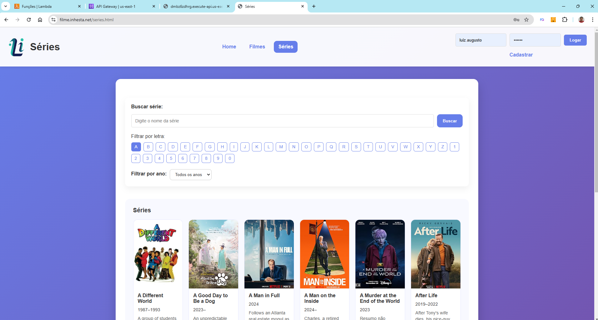
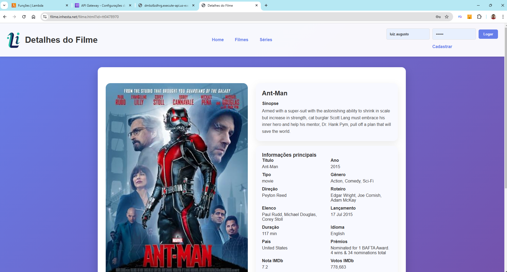

# 🌐 Integração Backend com Amazon API Gateway | Projeto AWS Filmes 5/1

## 📌 Sobre o Projeto

Nesta etapa do projeto, foi iniciada a integração entre o frontend e o backend utilizando o **Amazon API Gateway**, permitindo a comunicação entre a aplicação web e as funções serverless desenvolvidas com AWS Lambda ☁️

O objetivo é expor as funções backend através de endpoints HTTP públicos, criando uma arquitetura moderna baseada em APIs, seguindo boas práticas utilizadas em ambientes profissionais 🚀

.jpg)
---

## 🚀 Evolução do Projeto

Esse projeto continua crescendo com foco em um ambiente completo, utilizando serviços como:

✔️ **Amazon S3** – Hospedagem do site estático
✔️ **Amazon CloudFront** – Distribuição CDN + OAC 🔒
✔️ **Amazon Route 53** – Gerenciamento de domínio
✔️ **AWS Certificate Manager** – HTTPS 🔐

✔️ **AWS Lambda** – Backend Serverless
✔️ **Amazon API Gateway** – Exposição das APIs *(etapa atual)*

➡️ **Amazon DynamoDB** – Banco de dados *(próxima etapa)*

---

## 🎯 Objetivos

* Criar endpoints HTTP para comunicação com o frontend 🌐
* Integrar funções Lambda ao API Gateway ⚡
* Estruturar rotas para login, cadastro, filmes e favoritos 🎬
* Trabalhar com arquitetura serverless moderna ☁️
* Implementar comunicação frontend + backend
* Aplicar boas práticas de APIs HTTP

---

## 🧱 Arquitetura Atual

Nesta etapa, a arquitetura da aplicação é composta por:

* **Amazon S3** – Frontend estático
* **Amazon CloudFront** – Distribuição global do conteúdo
* **Amazon API Gateway** – Exposição das APIs HTTP
* **AWS Lambda** – Execução das funções backend

.png)
---

## 🔁 Fluxo da Aplicação

Frontend (S3 + CloudFront)
⬇️
Amazon API Gateway 🌐
⬇️
AWS Lambda ⚡
⬇️
Processamento das requisições

---

## 🌐 Estrutura da API Gateway

A API foi criada utilizando o protocolo HTTP, permitindo integração simplificada com AWS Lambda e menor latência nas requisições 🚀

### 📸 Detalhes da API

```text
API Name: api-filmes
Protocol: HTTP
```

.png)

---

## 🛣️ Estrutura das Rotas

As rotas foram organizadas por responsabilidade da aplicação:

* 📁 `/login`
* 📁 `/cadastro`
* 📁 `/filmes`
* 📁 `/filme-detalhe`
* 📁 `/favoritos`
* 📁 `/cep`

Cada rota possui seus respectivos métodos HTTP:

* GET
* POST
* DELETE

Essa estrutura facilita manutenção, organização e escalabilidade 🚀

.png)

---

## ⚙️ Integração com AWS Lambda

Cada rota da API foi integrada diretamente com funções AWS Lambda responsáveis pelo processamento das requisições.

Exemplo:

* GET `/cep` → Lambda consulta CEP
* POST `/login` → Lambda autenticação
* GET `/filmes` → Lambda busca filmes

.png)

---

## 🔐 Configuração de CORS

Foi realizada a configuração de CORS para permitir a comunicação segura entre o frontend hospedado no CloudFront e o backend exposto pelo API Gateway 🌍

### 🌐 Domínio autorizado

```text
https://filme.inhesta.net
```

### ⚙️ Métodos liberados

* GET
* POST
* PUT
* DELETE
* OPTIONS

### 📦 Headers permitidos

* content-type
* authorization

.png)

---

## 🚀 Deploy da API

Após configuração das rotas e integrações, foi realizado o deploy da API utilizando o estágio padrão `$default`.

Isso permite que as alterações sejam disponibilizadas automaticamente para utilização no frontend 🚀

---

## 🌐 Comunicação Frontend + Backend

O frontend hospedado no Amazon S3 passou a consumir diretamente os endpoints criados no API Gateway.

Foi criada uma estrutura centralizada para comunicação com a API utilizando JavaScript.

### 📸 Configuração da API no frontend

```javascript
const API_BASE_URL = "https://dmbz6zdhrg.execute-api.us-east-1.amazonaws.com";
```

---

## 🔍 Funcionalidades Integradas

### 🔐 Login

* Comunicação frontend + backend
* Requisições POST
* Validação via Lambda

---

### 📝 Cadastro

* Registro de usuários
* Integração com API Gateway
* Comunicação HTTP

---

### 📍 Consulta de CEP

* Busca automática de endereço
* Integração com ViaCEP
* API consumida via Lambda

---

### 🎬 Busca de Filmes

* Integração entre frontend e backend
* Consumo de APIs externas
* Estrutura serverless

---

### 📺 Séries

* Consulta de séries
* Comunicação via API Gateway
* Integração com Lambda

---

### 🎥 Detalhes do Filme

* Consulta detalhada por ID
* Informações completas do filme
* Renderização dinâmica no frontend

---

## 🧪 Testes das APIs

Os testes das APIs foram realizados utilizando:

* Navegador
* Frontend da aplicação
* Console AWS
* Requisições HTTP

### 🔹 Exemplo de endpoint

```text
https://dmbz6zdhrg.execute-api.us-east-1.amazonaws.com/cep?cep=04855550
```

### 🔹 Exemplo de resposta

```json
{
  "logradouro": "Rua Maria Santos Ferreira",
  "bairro": "Jardim Myrna II",
  "cidade": "São Paulo",
  "estado": "SP"
}
```
.png)
---

## 🧠 Conceitos Trabalhados

Nesta etapa do projeto foram trabalhados conceitos importantes como:

✔️ APIs HTTP
✔️ Comunicação frontend + backend
✔️ Métodos HTTP
✔️ CORS
✔️ Rotas e integrações
✔️ Arquitetura Serverless
✔️ Consumo de APIs
✔️ Integração entre serviços AWS

---

## 🚀 Benefícios do API Gateway

* 🌐 Exposição simplificada de APIs
* ⚡ Integração direta com AWS Lambda
* 📈 Escalabilidade automática
* ☁️ Arquitetura moderna serverless
* 🔗 Facilidade de integração com frontend
* 🔒 Controle de comunicação entre aplicações

---

## 📸 Fotos do Projeto

<p align="center">
  
  
  
</p>
<p align="center">
  
  
  
</p>

---

## 🧠 Aprendizados

* Criação de APIs HTTP na AWS
* Configuração de rotas e métodos
* Integração com AWS Lambda
* Comunicação frontend + backend
* Estruturação de endpoints
* Configuração de CORS
* Organização de arquitetura serverless

---

## 📌 Próximos Passos

* 🗄️ Integração com banco de dados
* ❤️ Salvamento de favoritos
* 🔐 Persistência de usuários
* 🚀 Evolução das APIs

---

## ▶️ Vídeo do Projeto

Youtube: https://youtu.be/x1VQJ_WDgaI

Linkedin: https://www.linkedin.com/in/luiz-inhesta-341b4b311/

---

## 👨‍💻 Autor

Projeto desenvolvido por **Luiz Inhesta** 💻
Focado em evolução prática em Cloud ☁️🚀
